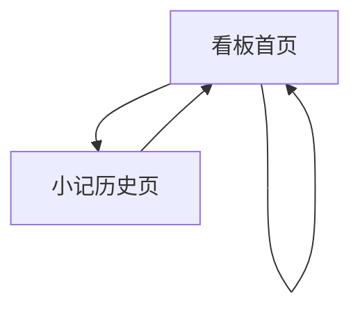

## 1. Product Overview
“OpenClaw 像素办公室”是一块可视化动画看板：龙虾在像素办公室场景中按状态移动。
你可以记录并回看每日工作小记，同时通过状态面板快速切换当天工作节奏。

## 2. Core Features

### 2.1 Feature Module
本产品包含以下主要页面：
1. **看板首页**：像素办公室场景、龙虾状态与移动动画、状态面板、今日小记与最近小记。
2. **小记历史页**：按日期浏览小记、查看/编辑小记内容、按状态筛选。

### 2.2 Page Details
| Page Name | Module Name | Feature description |
|-----------|-------------|---------------------|
| 看板首页 | 像素办公室场景 | 渲染办公室像素背景与可交互热点（工位/会议室/休息区等）；根据状态驱动龙虾在区域间移动与停留。 |
| 看板首页 | 龙虾状态机 | 显示当前状态（如专注/会议/休息/下班）；切换状态后更新目标区域、速度与动画表现。 |
| 看板首页 | 状态面板 | 一键切换状态；展示当日状态摘要（当前状态、开始时间、当日状态切换次数）。 |
| 看板首页 | 今日工作小记 | 录入/编辑“今日小记”（标题可选、正文必填）；自动保存；显示最后保存时间。 |
| 看板首页 | 最近小记列表 | 展示最近 N 天小记摘要；点击跳转到小记历史页定位到对应日期。 |
| 小记历史页 | 日期浏览与筛选 | 以列表/日历（简化）方式选择日期；按状态筛选对应日期的小记。 |
| 小记历史页 | 小记详情维护 | 查看完整小记；编辑并保存；支持删除小记（仅本地数据）。 |

## 3. Core Process
- 你的日常流程：打开看板首页 → 通过状态面板切换当前状态 → 龙虾在办公室场景中移动到对应区域并循环播放动画 → 在“今日工作小记”中记录要点（自动保存）→ 需要回顾时进入小记历史页按日期查看与编辑。

