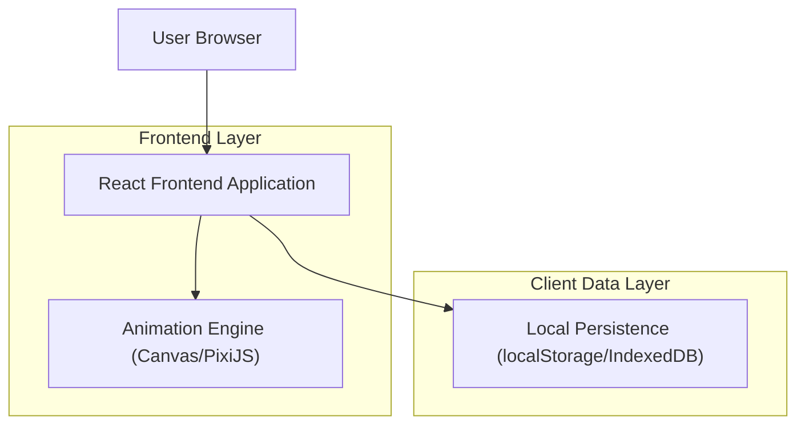
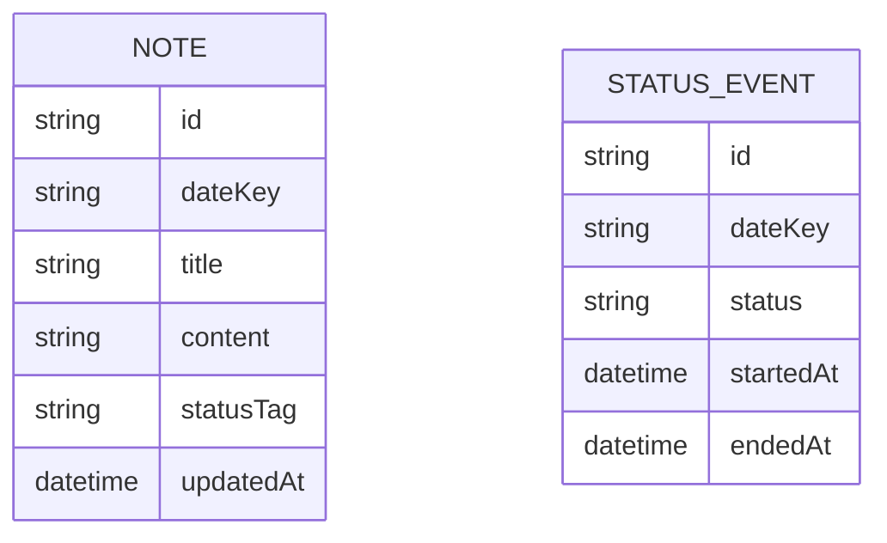

## 1.Architecture design

## 2.Technology Description
- Frontend: React@18 + vite + TypeScript + tailwindcss@3
- Animation: HTML5 Canvas（可选 PixiJS）
- State: Zustand（或 React Context + reducer）
- Backend: None（数据默认存本地，适合个人看板快速落地）

## 3.Route definitions
| Route | Purpose |
|-------|---------|
| / | 看板首页：办公室像素场景、龙虾状态与移动动画、状态面板、今日小记、最近小记 |
| /notes | 小记历史页：按日期浏览/筛选、查看与编辑小记 |

## 6.Data model(if applicable)
### 6.1 Data model definition

### 6.2 Data Definition Language
（本方案默认前端本地存储，不提供数据库 DDL；若后续需要多端同步，再引入 Supabase 并补充表结构与 RLS 规则。）